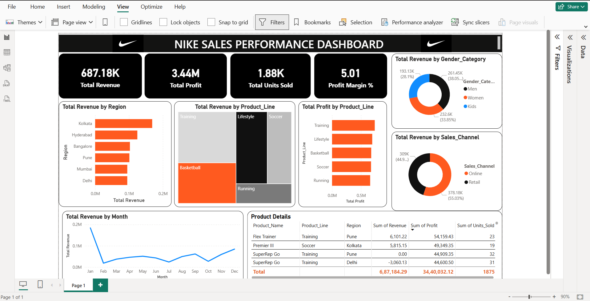

# Nike Sales Performance Dashboard

## 📊 Project Overview

This Power BI dashboard analyzes Nike sales performance across regions, product lines, sales channels, and customer segments.

The project demonstrates data cleaning, transformation, data modeling, DAX calculations, KPI tracking, and business intelligence reporting.

---

## Dashboard Preview

---

## Key Metrics

- Total Revenue: 687.18K
- Total Profit: 3.44M
- Total Units Sold: 1.88K
- Profit Margin: 5.01%

---

## Features

### Revenue Analysis
- Revenue by Region
- Revenue by Product Line
- Monthly Revenue Trend

### Profitability Analysis
- Profit by Product Line
- Profit Margin Tracking

### Customer Analysis
- Revenue by Gender Category
- Sales Channel Performance

### Interactive Reporting
- Dynamic Filters
- Drill-down Analysis
- KPI Cards

---

## Tools & Technologies

- Power BI
- Power Query
- DAX
- Data Modeling
- Data Cleaning
- Data Visualization
- Business Intelligence

---

## Skills Demonstrated

- Data Analysis
- Dashboard Development
- KPI Reporting
- Data Transformation
- Business Intelligence
- Power BI Development

---

## Repository Contents

- Nike_Sales_Dashboard.pbix
- Nike_Sales_Uncleaned.xlsx
- dashboard-preview.png

---

## Author

Akash R

LinkedIn: www.linkedin.com/in/akash-r2003
GitHub: https://github.com/AkashR2003
